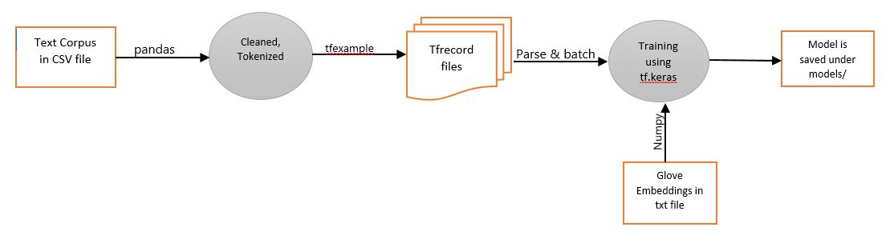

## Tweet Sentiment Prediction

#### About
This is a 3-way multiclass classification task where the tweets are categorized to 3 types: positive, negative and neutral.

This repository includes corpus data cleaning, EDA and tokenization. A custom tf.keras network built using RNNs is then trained and evaluated. 

Data Source : https://www.kaggle.com/c/tweet-sentiment-extraction/data

#### Data Flow

#### Credits

* Data Source: [Kaggle](https://www.kaggle.com/c/tweet-sentiment-extraction/data)
* GloVe 100D embeddings: [Laurence Moroney](https://github.com/lmoroney)
